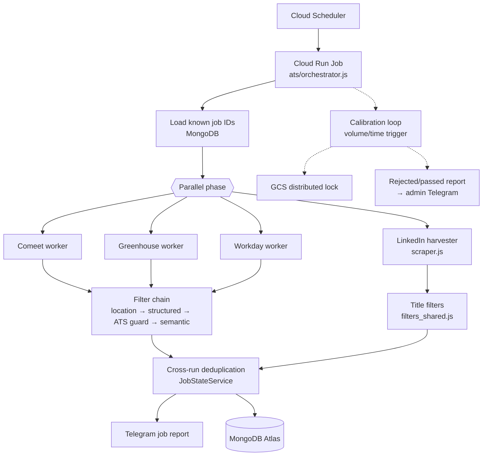

# Job Aggregation Engine

An automated ETL pipeline that collects entry-level and junior tech job postings in Israel from four sources, filters out noise with a multi-stage classification chain, deduplicates across runs, and pushes only new, relevant roles to Telegram. It runs unattended as a scheduled **Google Cloud Run Job** backed by **MongoDB Atlas**.

| Source | Integration |
|---|---|
| **LinkedIn** | Reverse-engineered internal Voyager REST + GraphQL API (cookie + CSRF auth) |
| **Comeet** | Token-based public API, paced by a shared token-bucket rate limiter |
| **Greenhouse** | Public job-board API |
| **Workday** | Session-based API with per-tenant cookie jar negotiation (Akamai-protected) |

---

## Architecture



A run in brief:

1. **Pre-load.** Seen and sent job IDs are loaded into one in-memory set, so already-known postings are skipped before any detail fetch.
2. **Parallel ingestion.** The three ATS workers run concurrently with the LinkedIn harvester (`Promise.allSettled`). A failure in one source never aborts the others.
3. **Filtering.** Each job passes a layered gate: an Israel location gate, a structured gate on ATS metadata, a title/department/description guard, and a semantic title filter.
4. **Deduplication and notification.** New jobs are sent as Telegram cards with an Apply button. A gatekeeper suppresses empty reports, except for a daily heartbeat.
5. **Persistence.** State is written only after the report is delivered, so a failed send is retried on the next run instead of being lost.

## Engineering highlights

- **API reverse engineering.** LinkedIn's Voyager jobs endpoint has no public documentation. Its behaviour was mapped through about 230 controlled live probes into a measured specification ([docs/VOYAGER_JOBS_ENDPOINT_GOLD_STANDARD.md](docs/VOYAGER_JOBS_ENDPOINT_GOLD_STANDARD.md)). As a result, the whole target pool is harvested in a handful of requests instead of a brittle boolean-query matrix.
- **Anti-bot resilience.** The pipeline uses Workday session and cookie negotiation, WAF-aware cooldowns for Comeet (403/406), request jitter, and redirect interception that detects LinkedIn auth challenges and raises an admin alert.
- **Quota fail-safe on a free-tier database.** The MongoDB Atlas M0 tier has a 512 MB cap. A volume trigger purges calibration data well before the cap. When quota is exhausted, the orchestrator sends exactly one emergency alert, guarded by an atomic GCS flag, and exits cleanly so Cloud Run doesn't enter a retry loop.
- **Distributed locking.** Calibration runs under a GCS object lock (`ifGenerationMatch: 0`) with in-app TTL recovery for stale locks, so overlapping executions can't double-purge.
- **Measured filter calibration.** Rejected and passed jobs are sampled and turned into periodic false-positive and false-negative reports. Filter vocabularies are tuned from those reports, not guesswork.
- **Storage abstraction.** A `StorageAdapter` interface has a MongoDB implementation for production and a file-based one for local development.

## Tech stack

**Runtime:** Node.js 20 · **Cloud:** Google Cloud Run Jobs, Cloud Scheduler, Cloud Build, Cloud Storage, Secret Manager · **Data:** MongoDB Atlas · **HTTP:** axios, tough-cookie, Bottleneck · **Notifications:** Telegram Bot API · **Tooling:** Puppeteer (local company discovery only), Docker

## Repository layout

```
ats/
  orchestrator.js     Entry point: runs all sources, calibration, dedup, notify, persist
  workers/            Comeet, Greenhouse and Workday workers
  filters/            ATS guard and structured gate
  utils/              HTTP client, rate limiter, location and semantic gates, job normalizer
  config/             Company configuration loader
scraper.js            LinkedIn harvest and enrichment pipeline
linkedin_client.js    Voyager API client (auth, encoding, redirect handling)
filters_shared.js     Shared title-classification rules
config/               Centralized paths and filter vocabulary
services/
  storage/            StorageAdapter interface with Mongo and file implementations
  notifications/      Telegram job reports and admin alerts
  calibration/        Calibration report generation
  lock/               GCS distributed calibration lock
  emergency/          Quota-exhaustion alert manager
  JobStateService.js  Cross-run deduplication state
tools/                Local-only CLIs: company discovery, validation, injection, calibration
data/                 Company lists and captured raw API samples used for schema analysis
docs/                 System reference, data contracts, API research
PRD/                  Product requirement documents for the calibration system
```

## Running locally

**Prerequisites:** Node.js 20+. For production-like runs you also need a MongoDB connection string. To use the local file-based storage adapter instead, leave `MONGODB_URI` empty and clear `STORAGE_BACKEND` in `.env`.

```bash
npm ci
cp .env.example .env        # then fill in the values you need
```

Useful environment flags (all default to `false`):

| Flag | Effect |
|---|---|
| `DRY_RUN=true` | No notifications and no state persistence |
| `SKIP_LINKEDIN=true` | Run the ATS sources only |
| `SKIP_ATS=true` | Run LinkedIn only |

```bash
# ATS sources only, with no side effects
DRY_RUN=true SKIP_LINKEDIN=true node ats/orchestrator.js
```

The LinkedIn source needs session cookies from a logged-in browser. See [docs/docs_voyager_auth.md](docs/docs_voyager_auth.md).

## Deployment

The container image (`Dockerfile`, `node:20-slim`, non-root user, production dependencies only) is built with Cloud Build (`cloudbuild.yaml`) and deployed as a Cloud Run Job. Cloud Scheduler triggers it on a fixed cadence. Secrets are injected from Secret Manager as environment variables. `infrastructure_update.sh` holds the hardened job settings: memory, task timeout, zero retries, the GCS lock bucket lifecycle and the scheduler deadline.

## Documentation

| Document | Contents |
|---|---|
| [docs/SYSTEM_REFERENCE.md](docs/SYSTEM_REFERENCE.md) | Full system reference: architecture, file map, invariants, calibration, deployment, runbook |
| [docs/DATA_CONTRACTS.md](docs/DATA_CONTRACTS.md) | Evidence-tagged schemas and attribute flow from each source to storage and notifications |
| [docs/EXTERNAL_COMMUNICATIONS.md](docs/EXTERNAL_COMMUNICATIONS.md) | How the system authenticates, paces and recovers against each data source |
| [docs/VOYAGER_JOBS_ENDPOINT_GOLD_STANDARD.md](docs/VOYAGER_JOBS_ENDPOINT_GOLD_STANDARD.md) | Measured specification of the LinkedIn jobs endpoint |
| [docs/linkedin_encoding_guide.md](docs/linkedin_encoding_guide.md) | Voyager URL-encoding rules |
| [docs/ARCHITECTURE_PATHS.md](docs/ARCHITECTURE_PATHS.md) | Filesystem layout conventions |
| [PRD/](PRD/) | Product requirements for automated calibration and worker validation |
