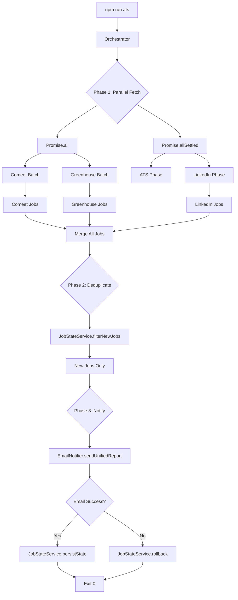

# Project Snapshot: Unified Orchestration Architecture
**Date:** 2026-01-31  
**Version:** 2.0  
**Status:** Unified Production Ready  
**Author:** System Architecture Session

---

## Executive Summary

This snapshot documents the completion of a major architectural milestone: the transformation of a standalone LinkedIn job scraper into a **unified multi-source job aggregation engine**. The system now orchestrates three independent data sources (LinkedIn, Comeet, Greenhouse) through a central brain with true parallel execution, unified deduplication, and consolidated email reporting.

---

## 1. System Architecture View: The "Unified Pipeline"

### 1.1 High-Level Flow

```
┌─────────────────────────────────────────────────────────────────────────┐
│                         ORCHESTRATOR (orchestrator.js)                   │
│                              "The Brain"                                 │
├─────────────────────────────────────────────────────────────────────────┤
│                                                                          │
│  ┌──────────────────── PHASE 1: PARALLEL FETCH ────────────────────┐    │
│  │                                                                  │    │
│  │   Promise.all([                    Promise.allSettled([         │    │
│  │     ComeetBatch,        ║            AtsPhase,                  │    │
│  │     GreenhouseBatch     ║            LinkedInPhase              │    │
│  │   ])                    ║          ])                           │    │
│  │        │                ║               │                       │    │
│  │        ▼                ║               ▼                       │    │
│  │   [ATS Jobs]            ║        [LinkedIn Jobs]                │    │
│  │                         ║                                        │    │
│  └─────────────────────────╨────────────────────────────────────────┘    │
│                                    │                                     │
│                                    ▼                                     │
│  ┌──────────────────── PHASE 2: MERGE & DEDUPLICATE ────────────────┐   │
│  │                                                                   │   │
│  │   allJobs = [...atsJobs, ...linkedinJobs]                        │   │
│  │                         │                                         │   │
│  │                         ▼                                         │   │
│  │              JobStateService.filterNewJobs(allJobs)              │   │
│  │                         │                                         │   │
│  │                         ▼                                         │   │
│  │              newJobs (only unseen IDs)                           │   │
│  │                                                                   │   │
│  └───────────────────────────────────────────────────────────────────┘   │
│                                    │                                     │
│                                    ▼                                     │
│  ┌──────────────────── PHASE 3: UNIFIED NOTIFICATION ───────────────┐   │
│  │                                                                   │   │
│  │   EmailNotifier.sendUnifiedReport(newJobs, errors)               │   │
│  │                         │                                         │   │
│  │   - Maps to legacy format                                        │   │
│  │   - Adds source labels (🔗🟢🌿)                                  │   │
│  │   - Includes error summary if any                                │   │
│  │   - Handles "no jobs" case                                       │   │
│  │                                                                   │   │
│  └───────────────────────────────────────────────────────────────────┘   │
│                                    │                                     │
│                                    ▼                                     │
│  ┌──────────────────── PHASE 4: PERSIST STATE ──────────────────────┐   │
│  │                                                                   │   │
│  │   if (emailSuccess) {                                            │   │
│  │     JobStateService.persistState();  // Commit new IDs           │   │
│  │   } else {                                                        │   │
│  │     JobStateService.rollback();      // Discard pending          │   │
│  │   }                                                               │   │
│  │                                                                   │   │
│  └───────────────────────────────────────────────────────────────────┘   │
│                                                                          │
└─────────────────────────────────────────────────────────────────────────┘
```

### 1.2 The Five Phases Explained

#### Phase 1: Parallel Fetch

The orchestrator executes data fetching from all sources **simultaneously**, not sequentially.

**ATS Level Parallelism:**
```javascript
// Companies split by type
const comeetCompanies = companies.filter(c => c.type === 'comeet');
const greenhouseCompanies = companies.filter(c => c.type === 'greenhouse');

// TRUE parallel execution
const [comeetResult, greenhouseResult] = await Promise.all([
  processBatch(comeetCompanies, comeetWorker, 'comeet'),
  processBatch(greenhouseCompanies, greenhouseWorker, 'greenhouse'),
]);
```

**Top Level Parallelism:**
```javascript
// ATS and LinkedIn run simultaneously
const [atsResult, linkedinResult] = await Promise.allSettled([
  runAtsWorkers(atsErrors),
  runLinkedInPhase(linkedinErrors),
]);
```

**Runtime Impact:** Total execution time is `Max(Time_ATS, Time_LinkedIn)` instead of `Sum()`.

#### Phase 2: LinkedIn Dual-Mode

The `scraper.js` module was refactored to support two execution modes:

| Mode | Triggered By | Email Behavior | Returns |
|------|--------------|----------------|---------|
| **Standalone** | `node scraper.js` | Sends its own email | N/A (script exits) |
| **Module** | `runLinkedinScraper({ skipEmail: true })` | Skips email | `Array<Job>` |

```javascript
// Refactored export
async function runLinkedinScraper(options = {}) {
  const { skipEmail = false } = options;
  // ... execution logic ...
  return allNewJobs;
}

// Standalone guard
if (require.main === module) {
  runLinkedinScraper().catch(err => process.exit(1));
}

module.exports = { runLinkedinScraper };
```

#### Phase 3: Deduplication via JobStateService

The `JobStateService` prevents duplicate email notifications across runs.

**Storage:** `data/ats_sent_jobs_history.json`

**Interface:**
```javascript
class JobStateService {
  loadHistory()           // Load sent IDs from disk
  filterNewJobs(jobs)     // Returns only NEW jobs (not in history)
  persistState()          // Commit pending IDs to disk
  rollback()              // Discard pending IDs (if email failed)
}
```

**Algorithm:**
1. Load historical Set of job IDs on startup
2. For each incoming job, check if `jobId` exists in Set
3. New jobs are added to a "pending" Set (not committed yet)
4. Only after successful email, pending IDs are merged into history

#### Phase 4: Unified Notification (Adapter Pattern)

The `EmailNotifier` service acts as an **adapter** between the new unified job format and the legacy mailer.

**Responsibilities:**
1. Map `UnifiedJob` → Legacy format (add `company`, `title`, `url`)
2. Prepend source labels: `[🔗 LinkedIn]`, `[🟢 Comeet]`, `[🌿 Greenhouse]`
3. Generate error summary section if any workers failed
4. Handle "no jobs found" case with friendly message
5. **Never crash** - always returns `true/false`

```javascript
async sendUnifiedReport(jobs, errors = []) {
  // Case A: Jobs found → send rich email with cards
  // Case B: No jobs → send "📭 No New Jobs" email
  // Case C: Errors → prepend ⚠️ error summary
  return success;
}
```

#### Phase 5: State Persistence

State is persisted **only after successful email notification**:

```javascript
const emailSuccess = await sendNotification(newJobs, errors);

if (emailSuccess) {
  jobStateService.persistState();  // Safe to commit
} else {
  jobStateService.rollback();      // Don't mark as "sent"
}
```

This ensures that if email fails, the same jobs will be retried on the next run.

---

## 2. Current Phase Status

| Milestone | Status |
|-----------|--------|
| Phase 1: LinkedIn Scraper | ✅ Complete |
| Phase 2: Greenhouse Integration | ✅ Complete |
| Phase 3: Orchestration & Parallelism | ✅ Complete |
| Phase 4: Production Deployment | 🔄 Ready for Testing |

**Current State:** 
- System processes **100+ companies** (Comeet + Greenhouse) plus LinkedIn queries
- Concurrent execution completes in **~4-5 minutes**
- Single unified email report sent per run

---

## 3. Core Achievements (Technical Delta)

### 3.1 True Parallelism

**Before:** Sequential loop through all companies
```javascript
// OLD: Greenhouse waited for ALL Comeet companies
for (const company of companies) {
  await worker.fetchAllJobs(company);
}
```

**After:** Split + Parallel batches
```javascript
// NEW: Both start immediately
await Promise.all([
  processBatch(comeetCompanies, comeetWorker),
  processBatch(greenhouseCompanies, greenhouseWorker),
]);
```

### 3.2 Dashboard Mode (Quiet Console)

**Problem:** Console was flooded with per-company logs, making progress hard to track.

**Solution:**
- Detailed logs → Written to `runtime.log` files via `logRuntime()`
- Console → Shows only high-level progress: `Comeet: 5/80 | Greenhouse: 2/28`

```javascript
function logRuntime(message, level = 'INFO') {
  const logLine = `[${timestamp}] [${level}] ${message}\n`;
  fs.appendFileSync(RUNTIME_LOG_PATH, logLine);
  
  // Only show errors in console
  if (!QUIET_MODE || level === 'ERROR') {
    console.error(`[GH] ${message}`);
  }
}
```

### 3.3 Safety Mechanisms

| Mechanism | Implementation | Purpose |
|-----------|----------------|---------|
| **Greenhouse Jitter** | 6-12s random delay | Match human pacing, avoid WAF |
| **Comeet Jitter** | 3-6s random delay | Rate limiting protection |
| **Error Isolation** | try/catch per company | One failure doesn't stop run |
| **Graceful Exit** | Exit code 0 unless total failure | Scheduler compatibility |

### 3.4 Resilience

The system continues execution even when individual components fail:

```javascript
// Company-level isolation
try {
  await worker.fetchAllJobs(company);
  succeeded++;
} catch (err) {
  failed++;
  errors.push({ source: company.id, message: err.message });
  // Continue to next company
}
```

---

## 4. Configuration Snapshot

### 4.1 Execution

| Command | Description |
|---------|-------------|
| `npm run ats` | Run full orchestrator (ATS + LinkedIn) |
| `node scraper.js` | Run LinkedIn standalone (legacy mode) |
| `node tools/run_greenhouse_debug.js` | Debug Greenhouse only |

### 4.2 Environment Variables

| Variable | Default | Description |
|----------|---------|-------------|
| `SKIP_LINKEDIN` | `false` | Skip LinkedIn phase |
| `SKIP_ATS` | `false` | Skip Comeet/Greenhouse phase |
| `DRY_RUN` | `false` | Skip file writes and emails |
| `ATS_QUIET_MODE` | `true` | Silence detailed console output |
| `GREENHOUSE_DELAY_MIN_MS` | `6000` | Min delay before Greenhouse fetch |
| `GREENHOUSE_DELAY_MAX_MS` | `12000` | Max delay before Greenhouse fetch |
| `COMEET_DELAY_MIN_MS` | `3000` | Min delay for Comeet |
| `COMEET_DELAY_MAX_MS` | `6000` | Max delay for Comeet |

### 4.3 Logging Paths

| Log Type | Path |
|----------|------|
| Comeet Runtime | `logs/ats/comeet/runtime.log` |
| Greenhouse Runtime | `logs/ats/greenhouse/runtime.log` |
| ATS Summaries | `logs/ats/summaries/` |
| LinkedIn Summaries | `logs/linkedin/summaries/` |
| Dedup History | `data/ats_sent_jobs_history.json` |

### 4.4 Source Labels in Email

| Source | Label | Color |
|--------|-------|-------|
| LinkedIn | 🔗 LinkedIn | Blue |
| Comeet | 🟢 Comeet | Green |
| Greenhouse | 🌿 Greenhouse | Green |

---

## 5. Observability & Maintenance

### 5.1 Multi-Terminal Monitoring Setup

For optimal visibility during a run, use three terminals:

**Terminal 1: Orchestrator (Main)**
```powershell
npm run ats
```
Shows: Phase transitions, progress counters, final summary.

**Terminal 2: Greenhouse Logs (Tail)**
```powershell
Get-Content logs/ats/greenhouse/runtime.log -Wait
```
Shows: Per-company fetch details, delays, job counts.

**Terminal 3: Comeet Logs (Tail)**
```powershell
Get-Content logs/ats/comeet/runtime.log -Wait
```
Shows: Per-company fetch details, WAF blocks, retries.

### 5.2 Interpreting Log Output

**Runtime Log Format:**
```
[2026-01-31T23:00:15.123Z] [INFO] Sleeping for 8234ms before fetching AppsFlyer...
[2026-01-31T23:00:23.357Z] [DEBUG] Fetching: AppsFlyer (UID: appsflyer)
[2026-01-31T23:00:24.891Z] [INFO] AppsFlyer - Fetched: 45, Guard: 12/33, Final: 12
```

**Console Progress Format:**
```
📊 PHASE 1: ATS Workers (Comeet & Greenhouse) - PARALLEL
📂 Loaded 108 companies (Comeet: 80, Greenhouse: 28)
   Comeet: 45/80 | Greenhouse: 28/28
✅ ATS Phase complete: 342 jobs (Comeet: 256, Greenhouse: 86)
```

---

## 6. Next Strategic Steps

### 6.1 Immediate (This Week)

- [ ] **Monitor First Scheduled Runs:** Verify `JobStateService` correctly identifies "new" vs "seen" jobs
- [ ] **Validate "No Jobs" Email:** Ensure the `📭 No New Jobs` email is sent when all jobs are duplicates
- [ ] **Check Error Summaries:** Trigger a deliberate 404 to test error reporting in email

### 6.2 Short-Term (Next 2 Weeks)

- [ ] **Expand Greenhouse List:** Add remaining ~22 companies from the research spreadsheet
- [ ] **Tune Delays:** Based on actual WAF detection rates, adjust `GREENHOUSE_DELAY_*` values
- [ ] **Add Lever/Workday Workers:** Begin Phase 4 - additional ATS integrations

### 6.3 Long-Term (Future)

- [ ] **Web Dashboard:** Visualize `ats_sent_jobs_history.json` with stats and trends
- [ ] **Alerting:** Slack/Discord webhook on critical failures
- [ ] **Job Scoring:** ML-based relevance scoring before email

---

## 7. File Reference

| File | Purpose |
|------|---------|
| `ats/orchestrator.js` | Central brain, 5-phase execution flow |
| `ats/workers/comeetWorker.js` | Comeet API integration + ATS Guard |
| `ats/workers/greenhouseWorker.js` | Greenhouse API integration + ATS Guard |
| `services/JobStateService.js` | Deduplication, history persistence |
| `services/EmailNotifier.js` | Unified email generation, adapter pattern |
| `scraper.js` | LinkedIn scraper (dual-mode) |
| `config/paths.js` | Centralized path configuration |
| `data/ats_sent_jobs_history.json` | Persistent job ID history |
| `data/greenhouse_list.csv` | Greenhouse company definitions |
| `data/comeet_companies_auto.json` | Comeet company definitions |

---

## 8. Architecture Diagram (Mermaid)



---

**End of Snapshot**

*Generated: 2026-01-31T23:11:28+02:00*
